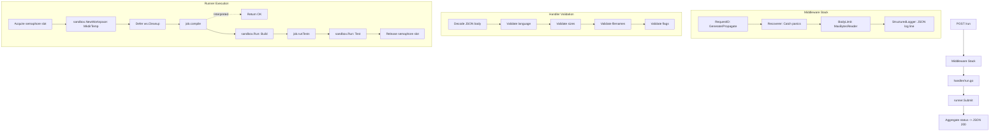

# Architecture

`goboxd` is a lightweight HTTP service that securely accepts untrusted source code, compiles or interprets it inside an `nsjail` sandbox, and returns per-test execution results.

---

## Request Lifecycle

The diagram below illustrates the journey of a single `POST /run` request through the system.



---

## Package Layout

The project follows a standard Go directory structure, separating the entry point, internal packages, and external configurations.

- **`cmd/goboxd/`**: The main entry point. Wires the configuration, registry, runner, and router.
- **`internal/`**: Core application logic.
  - `config/`: Configuration schemas (e.g., Environment variables, `LanguageDef`).
  - `registry/`: YAML loading, language lookup, and readiness probes.
  - `validate/`: Validation logic for filenames, flags, and size limits.
  - `sandbox/`: `nsjail` integration, temporary workspaces, and output capping.
  - `runner/`: Concurrency semaphore, job lifecycle management, and status aggregation.
  - `handler/`: HTTP handlers (`/run`, `/healthz`, `/readyz`, `/info`) and middleware.
  - `stats/`: Atomic counters for server statistics.
- **`configs/`**: Contains `languages.yaml`, defining all supported languages.
- **`tests/integration/`**: End-to-end integration tests (requires `integration` build tag).
- **`scripts/`**: Helper scripts.
  - `lang_install/`: Scripts to install toolchains inside the Docker image.
  - `load_test.sh`: Load testing scripts (`hey` / `k6`).
- **`docs/`**: Documentation files (architecture, security, API, etc.).

---

## Concurrency Model

`goboxd` employs a bounded concurrency model using a buffered channel semaphore. 

- **Capacity**: Defined by `MAX_CONCURRENT_JOBS` (defaults to `runtime.NumCPU()`).
- **Behavior**: `runner.Submit()` blocks until a slot is available. 
- **Benefits**:
  - Requests queue instead of failing when the service reaches capacity.
  - The number of in-flight `nsjail` processes remains strictly bounded.
  - Prevents host exhaustion.

> **Note on Test Execution:** Per-test execution is sequential within a job. Parallel test execution was considered but rejected because sequential execution guarantees a deterministic file layout, avoids workspace race conditions, and `nsjail` process startup (not goroutines) is the primary bottleneck.

---

## Adding a New Language

Adding a language requires **no Go code changes**, provided the language fits the existing templates (`{{source}}`, `{{artifact}}`, `{{flags}}`).

1. **Define**: Add an entry to `configs/languages.yaml` (see [Languages Documentation](languages.md)).
2. **Script**: Create `scripts/lang_install/<language>.sh` to install the toolchain.
3. **Dockerfile**: Include the install script in the `Dockerfile`.
4. **Deploy**: Rebuild the Docker image. `/readyz` and `/info` will automatically detect and reflect the new language.

---

## Security Model

The sandbox was designed specifically to address seven known vulnerabilities from older systems. For a detailed breakdown, see the [Security Documentation](security.md).

| Layer | Protections Applied |
|-------|---------------------|
| **HTTP Middleware** | Request body size limits. |
| **Handler (`run.go`)** | Filename validation, strict flag allowlisting, source/stdin size checks. |
| **Workspace (`workspace.go`)**| Atomic temporary directories, pure-Go cleanup, startup orphan sweeps. |
| **Sandbox (`nsjail.go`)** | Output capping, pure `[]string` argument arrays (no shell interpretation), seccomp policies. |
| **Runner (`runner.go`)** | Guaranteed deferred cleanup on every exit path. |

---

## `nsjail` Invocation

`goboxd` invokes `nsjail` as a pure `[]string` slice via `os/exec`, completely bypassing the shell. 

Below is a representative invocation for compiling C++:

```bash
/usr/local/bin/nsjail \
  --mode o \
  --chroot /tmp/goboxd/goboxd-1234567890 \
  --user 65534 --group 65534 \
  --log_fd 3 \
  --max_cpus 1 \
  --rw \
  --cwd / \
  --detect_cgroupv2 \
  --rlimit_nofile 1000 \
  --env TMP=/ --env TMPDIR=/ --env HOME=/ \
  --env PATH=/usr/local/sbin:/usr/local/bin:/usr/sbin:/usr/bin:/sbin:/bin \
  --time_limit 10 \
  --rlimit_cpu 10 \
  --cgroup_mem_max 536870912 \
  --rlimit_as 512 \
  --cgroup_pids_max 100 \
  --rlimit_nproc 100 \
  --rlimit_fsize 100 \
  -R /bin -R /usr -R /lib -R /etc -R /dev -R /var \
  --seccomp_string 'POLICY goboxd_safe { KILL_PROCESS { ptrace, bpf, ... } } USE goboxd_safe DEFAULT ALLOW' \
  -- \
  /usr/bin/g++ -O2 -o solution solution.cpp
```

> **Key Takeaway**: There is no shell interpolation (`sh -c`) anywhere in the execution pipeline, eliminating shell injection vulnerabilities.
