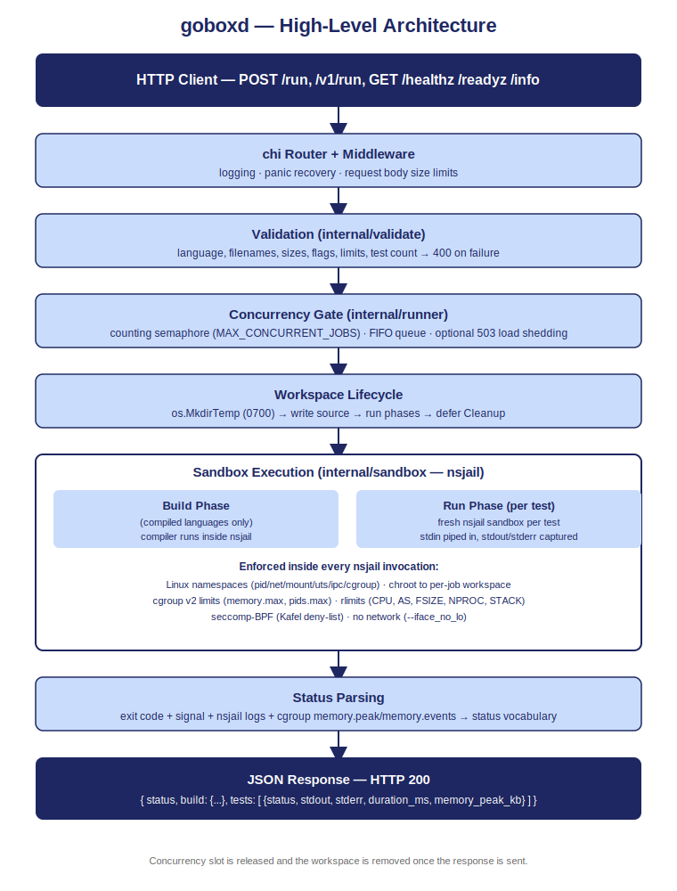
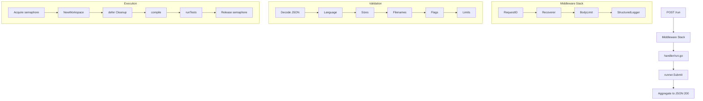

# Architecture

How a request flows from HTTP to sandbox and back.

<div align="center">
  
</div>

---

## Request Lifecycle



---

## Package Layout

| Package | Role |
|---------|------|
| `cmd/goboxd/` | Entry point: wires config, registry, probe cache, runner, and chi router |
| `internal/config/` | Env var parsing; `LanguageDef` and `LimitsDef` types |
| `internal/registry/` | YAML load and validate; `Get`/`All`; 30 s TTL probe cache |
| `internal/validate/` | Filename, flag, size, limit, and test-count validators; status constant definitions |
| `internal/sandbox/` | nsjail argv builder, `MkdirTemp` workspace, output capping, status parsing |
| `internal/runner/` | Counting semaphore, bounded queue, job lifecycle, status aggregation |
| `internal/handler/` | `/run`, `/healthz`, `/readyz`, `/info`; `BodyLimit` and `StructuredLogger` middleware |
| `internal/stats/` | Atomic counters: in-flight jobs, queue size, totals, error count |
| `internal/logctx/` | Context key for per-request fields written by handler, read by middleware |
| `internal/playground/` | Embeds the playground SPA at `/playground/` |
| `configs/languages.yaml` | All 15 language definitions (7 required + 8 additional) |
| `tests/integration/` | End-to-end tests (build tag: `integration`) |
| `tests/sandbox/` | Adversarial containment probe runner with 15 attack programs |

---

## Execution Modes

Two endpoints share one validation and execution path:

- **`POST /run`**: strict competition contract. `tests` required; no `exit_code` in response.
- **`POST /v1/run`**: superset; adds `exit_code` and selects mode by payload shape:
  - **raw**: empty `tests`; run once against top-level `stdin`, no grading
  - **verifier**: `tests` present; compare stdout to `expected_stdout`
  - **evaluator**: `evaluator` block present; grade each test with a custom program

---

## Concurrency

A buffered `chan struct{}` acts as a counting semaphore. Capacity is `MAX_CONCURRENT_JOBS` (default: `config.AvailableCPUs()`, which is the cgroup v2 CPU quota when set, otherwise `runtime.NumCPU()`). `GOMAXPROCS` is set to the same value.

- Each request drives its own goroutine; no worker pool
- Blocked goroutines queue FIFO: fair, starvation-free, zero extra code
- Optional load shedding via `MAX_QUEUE_DEPTH`: returns `503 + Retry-After` when queue is full

Full rationale, tuning guide, and benchmark data: [concurrency.md](concurrency.md)

---

## Adding a Language

No Go code change needed for languages that fit the existing templates (`{{source}}`, `{{artifact}}`, `{{flags}}`):

1. Add a block to `configs/languages.yaml`
2. Add `scripts/lang_install/<id>.sh` (the Dockerfile loops over every script there automatically)
3. Run `make build`; `/readyz` reports the new language immediately

Step-by-step runbook with worked examples: [adding-a-language.md](adding-a-language.md)  
Field-by-field schema and current catalog: [languages.md](languages.md)

---

## nsjail Invocation

<details>
<summary>Representative argv for a compiled C++ binary</summary>

```
/usr/local/bin/nsjail
  --mode o
  --chroot /tmp/goboxd/goboxd-42
  --user 60042 --group 60042
  --log_fd 3
  --max_cpus 1
  --rw
  --cwd /
  --hostname goboxd
  --detect_cgroupv2
  --cgroupv2_mount /sys/fs/cgroup/goboxd-42
  --rlimit_nofile 1000
  --rlimit_core 0
  --rlimit_stack 8
  --env TMP=/ --env TMPDIR=/ --env HOME=/
  --env PATH=/usr/local/sbin:/usr/local/bin:/usr/sbin:/usr/bin:/sbin:/bin
  --iface_no_lo
  --time_limit 5   --rlimit_cpu 6
  --cgroup_mem_max 268435456   --cgroup_mem_swap_max 0
  --rlimit_as 4096
  --cgroup_pids_max 64   --rlimit_nproc 64
  --rlimit_fsize 100
  -R /bin -R /usr -R /lib -R /etc -R /dev -R /var
  --seccomp_string 'POLICY goboxd_safe { KILL_PROCESS { ptrace, bpf, ... } } USE goboxd_safe DEFAULT ALLOW'
  --
  /solution
```

**Key design notes:**

- `--rlimit_as` = `max(memory_kb × 4 / 1024, 4096)` MiB. The 4096 MiB floor prevents false OOM kills on the JVM, which pre-allocates ~1 GiB of virtual address space at startup.
- `--cgroupv2_mount` points to a per-job subdirectory (`/sys/fs/cgroup/goboxd-42`), not the root. This keeps the parent `memory.peak` and `memory.events` readable after the child cgroup is torn down.
- `--cgroup_mem_swap_max 0` disables swap so memory limits are exact.
- OOM kills arrive as bare `SIGKILL` with no nsjail log line. `memory_exceeded` is detected by reading `memory.events` (`oom_kill > 0`), not by log parsing.
- nsjail log is captured on fd 3. `ParseBuildStatus` / `ParseRunStatus` distinguish `internal_error` (lines with `[E][` prefix) from normal exit codes.

</details>

---

<!-- nav-footer -->
<sub>[← Documentation index](README.md) · [API](api.md) · [Architecture](architecture.md) · [Concurrency](concurrency.md) · [Security](security.md) · [Languages](languages.md) · [Configuration](configuration.md)</sub>
