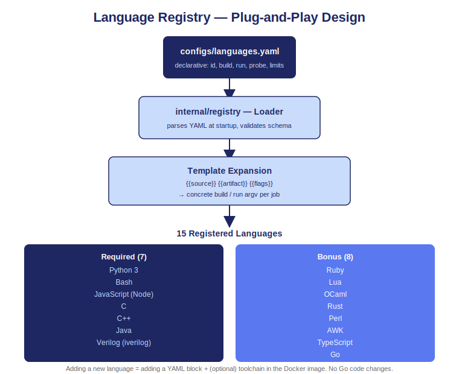

# Language Configuration

The entire language catalog lives in `configs/languages.yaml`. No Go code changes are required to add a language.

<div align="center">
  
</div>

---

## Supported Languages

### Required (in-scope)

| ID | Language | Type | Toolchain |
|----|----------|------|-----------|
| `py3` | Python 3 | Interpreted | `/usr/bin/python3` |
| `bash` | Bash | Interpreted | `/bin/bash` |
| `js` | JavaScript (Node.js) | Interpreted | `/usr/bin/node` |
| `c` | C | Compiled | `gcc` |
| `cpp` | C++ | Compiled | `g++` |
| `java` | Java | Compiled | `javac` / `java` |
| `verilog` | Verilog | Compiled | `iverilog` / `vvp` |

### Additional (all pass `/readyz`)

| ID | Language | Type | Toolchain |
|----|----------|------|-----------|
| `ruby` | Ruby | Interpreted | `/usr/bin/ruby` |
| `lua` | Lua 5.4 | Interpreted | `/usr/bin/lua5.4` |
| `ocaml` | OCaml | Interpreted | `/usr/bin/ocaml` |
| `rust` | Rust | Compiled | `/usr/bin/rustc` |
| `perl` | Perl | Interpreted | `/usr/bin/perl` |
| `awk` | AWK | Interpreted | `/usr/bin/awk` |
| `ts` | TypeScript | Compiled | `/usr/bin/tsc` then `/usr/bin/node` |
| `go` | Go | Compiled | `/usr/local/go/bin/go build` |

---

## YAML Schema

<details>
<summary>Full annotated example (C++)</summary>

```yaml
- id: cpp
  name: C++
  source_filename: solution.cpp    # fixed filename written into the workspace

  # Java uses from_request so the filename matches the public class name:
  # source_filename_strategy: from_request
  # artifact_filename_strategy: from_request

  build:                           # omit entirely for interpreted languages
    cmd: /usr/bin/g++
    args: ["{{flags}}", "-o", "{{artifact}}", "{{source}}"]
    limits:
      wall_time_s: 10
      memory_kb: 524288
      max_processes: 100
    flag_allowlist:                # unlisted flags return 400 invalid_flag
      - "-O2"
      - "-std=*"                   # trailing * means prefix match

  run:
    cmd: /solution                 # compiled artifact lives at the workspace root
    args: []
    limits:
      wall_time_s: 5
      memory_kb: 262144
      max_processes: 64

  env:                             # optional; injected via --env KEY=VALUE into nsjail
    - GO111MODULE=off
```

</details>

### Template Variables

| Placeholder | Expands to |
|-------------|------------|
| `{{source}}` | Absolute path to the source file in the workspace |
| `{{artifact}}` | Absolute path to the compiled output |
| `{{flags}}` | Zero or more validated client-supplied flags, expanded in-place |

Expansion happens element-by-element in `sandbox.ExpandArgs`, never through a shell.

---

## Readiness Probe

By default `/readyz` runs `<cmd> --version` against each language's run command (or `build.cmd` for compiled languages, since the run command is the per-job artifact). If a toolchain uses a different version flag, set **`probe_args`** in the YAML:

| Language | `probe_args` |
|----------|-------------|
| `lua` | `["-v"]` |
| `verilog` | `["-V"]` |
| `go` | `["version"]` |
| `perl` | `["-e", "print $^V"]` |

Any output at all counts as success, so toolchains that print to stderr and exit non-zero (like `javac`) still pass.

---

## Adding a Language

One YAML block plus one install script, with no Go code change. Typically under 10 minutes on a warm Docker cache.

Step-by-step runbook: [adding-a-language.md](adding-a-language.md)

---

<!-- nav-footer -->
<sub>[← Documentation index](README.md) · [API](api.md) · [Architecture](architecture.md) · [Concurrency](concurrency.md) · [Security](security.md) · [Languages](languages.md) · [Configuration](configuration.md)</sub>
