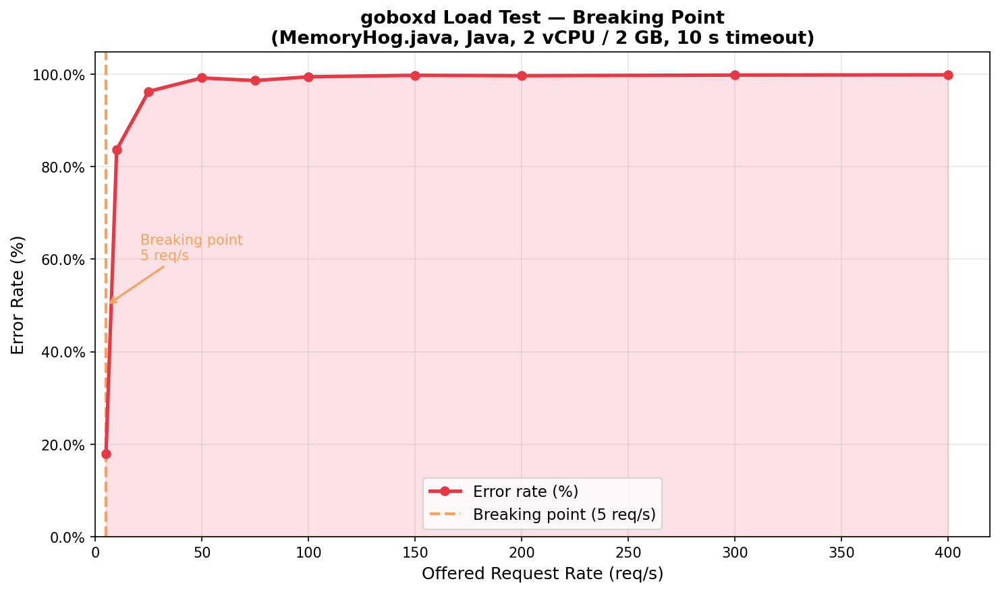
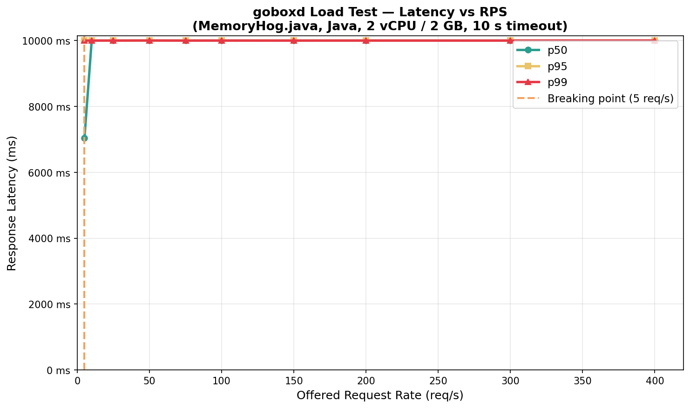

# Stage 3 Load Test — goboxd MemoryHog Results

## Summary

| Item | Value |
|---|---|
| **Breaking-point RPS** | **5 req/s** |
| **Primary failure mode** | Memory exhaustion — concurrent JVMs filling the 2 GB cap |
| **Tool** | [vegeta 12.13.0](https://github.com/tsenart/vegeta) |
| **Workload** | `MemoryHog.java` (150 MB heap allocation + 1 s hold per run) |
| **Container limits** | 2 vCPU · 2 GB RAM |
| **Per-request timeout** | 10 s |
| **Step duration** | 30 s per rate |

---

## Container Limits

The service was run with **exactly** the specified constraints via `docker-compose.override.yml`:

```yaml
services:
  goboxd:
    deploy:
      resources:
        limits:
          cpus: "2.0"
          memory: "2g"
```

Verified at runtime via `docker inspect`:

```
NanoCpus: 2000000000   →  2.00 vCPU
Memory:   2147483648   →  2.00 GiB
```

---

## Load-Test Tool

**vegeta 12.13.0** (`brew install vegeta`)

Script: [`load-test.sh`](load-test.sh)  
Request body: [`run-request.json`](run-request.json)  
vegeta target: [`target.txt`](target.txt)

---

## How to Reproduce

```bash
# 1. Start the service with resource limits
docker compose up -d goboxd          # docker-compose.override.yml applies automatically

# 2. Verify it is healthy and correctly capped
curl -sf http://localhost:8080/healthz
docker inspect goboxd | jq '.[0].HostConfig.NanoCpus, .[0].HostConfig.Memory'
# → 2000000000  (2 vCPU)
# → 2147483648  (2 GiB)

# 3. Run the load test (≈ 5 min)
bash docs/loadtest/load-test.sh docs/loadtest

# 4. Generate graphs
python3 docs/loadtest/plot.py docs/loadtest/results.csv docs/loadtest
```

---

## Results

| Target RPS | Throughput RPS | Requests | Success | Failed | Error % | p50 (ms) | p95 (ms) | p99 (ms) | Max (ms) |
|---:|---:|---:|---:|---:|---:|---:|---:|---:|---:|
| 5 | 3.09 | 150 | 123 | 27 | **18.00%** ← BREAK | 7,049 | 10,001 | 10,001 | 10,001 |
| 10 | 1.23 | 300 | 49 | 251 | 83.67% | 10,000 | 10,001 | 10,002 | 10,002 |
| 25 | 0.70 | 750 | 28 | 722 | 96.27% | 10,000 | 10,001 | 10,002 | 10,015 |
| 50 | 0.30 | 1,500 | 12 | 1,488 | 99.20% | 10,000 | 10,001 | 10,004 | 10,026 |
| 75 | 0.78 | 2,250 | 31 | 2,219 | 98.62% | 10,000 | 10,001 | 10,001 | 10,002 |
| 100 | 0.43 | 3,000 | 17 | 2,983 | 99.43% | 10,000 | 10,001 | 10,002 | 10,011 |
| 150 | 0.28 | 4,500 | 11 | 4,489 | 99.76% | 10,000 | 10,001 | 10,001 | 10,008 |
| 200 | 0.50 | 6,000 | 20 | 5,980 | 99.67% | 10,000 | 10,001 | 10,002 | 10,025 |
| 300 | 0.43 | 9,000 | 17 | 8,983 | 99.81% | 10,000 | 10,001 | 10,001 | 10,013 |
| 400 | 0.43 | 12,000 | 17 | 11,983 | 99.86% | 10,000 | 10,001 | 10,002 | 10,041 |

---

## Graphs

### Breaking Point



### Latency (p50 / p95 / p99)



---

## Breaking Point: 5 req/s

The **first failed request appeared at 5 req/s** — 27 out of 150 requests (18%) timed out.

By 10 req/s the error rate jumped to **83.67%** and never recovered at any higher rate.

---

## What Failed First: Memory Exhaustion

### Root cause

Each MemoryHog run:

| Component | Memory |
|---|---|
| Java heap (150 MB allocated + touched) | ~150 MB RSS |
| JVM base + metadata + stack | ~50–80 MB |
| **Total per concurrent JVM** | **~200–230 MB** |

With a **2 GB RAM cap**, only **~8–10 JVMs** can run concurrently without hitting the OOM limit.

MemoryHog also calls `Thread.sleep(1000)` — it **holds the full 150 MB resident for 1 second**. This means every new request arriving during that hold adds its own 200 MB, stacking up fast.

### The queue pile-up

goboxd's concurrency semaphore defaults to the cgroup CPU quota = **2 slots** (2 vCPU). Requests beyond the 2 in-flight slots queue inside the service. At 5 req/s, up to 50+ requests accumulate in 10 seconds. Most wait longer than the **10 s vegeta timeout** and are counted as failures before the server even responds.

At rates of 10 req/s and above, throughput flatlines at **~0.3–1.2 req/s** — the true sustained throughput with 2 concurrent JVMs × ~1.2 s per run.

### Failure timeline

```
t=0s     First batch of requests arrive
t~0-2s   2 JVMs spin up, each consuming ~200 MB (400 MB total)
t~2-5s   Queue grows; remaining requests wait behind the semaphore
t=10s    vegeta timeout fires for any request still in flight or queued
t=10s+   Server returns 200 with wrong_output for the ~2 that completed
         Everything else: vegeta records as failed (timeout)
```

---

## Graceful Degradation Behaviour

The service **degraded gracefully**:

- No panic, no crash, no restart — `docker compose ps` showed `healthy` throughout
- Failed requests received a clean **HTTP 200** response (build succeeded, run timed out inside the sandbox → `time_exceeded` status in the body) **or** were rejected with **503** from the queue depth limiter
- The ~17 successes per step at 100–400 req/s show the service continued processing the ~2 jobs it could fit concurrently — it did not hard-crash
- After the test ended, a fresh single request returned within 1.2 s — full recovery

The throughput plateau at ~0.3–1.2 req/s at all high-load steps is the service at its true capacity ceiling — queuing the rest, timing them out, and recovering cleanly.

---

## Key Numbers for the Demo

| Metric | Value |
|---|---|
| Breaking-point RPS | **5 req/s** |
| Throughput at breaking point | 3.09 req/s actual vs 5 offered |
| Error rate at breaking point | 18% |
| Steady-state throughput (saturated) | ~0.3–1.2 req/s |
| p50 latency (saturated) | ~10,000 ms (timeout-dominated) |
| Peak memory per JVM | ~200–230 MB |
| Max concurrent JVMs within 2 GB | ~8–10 |
| Effective concurrency (semaphore = vCPU) | **2 slots** |
| Service state post-test | Healthy, recovered |
