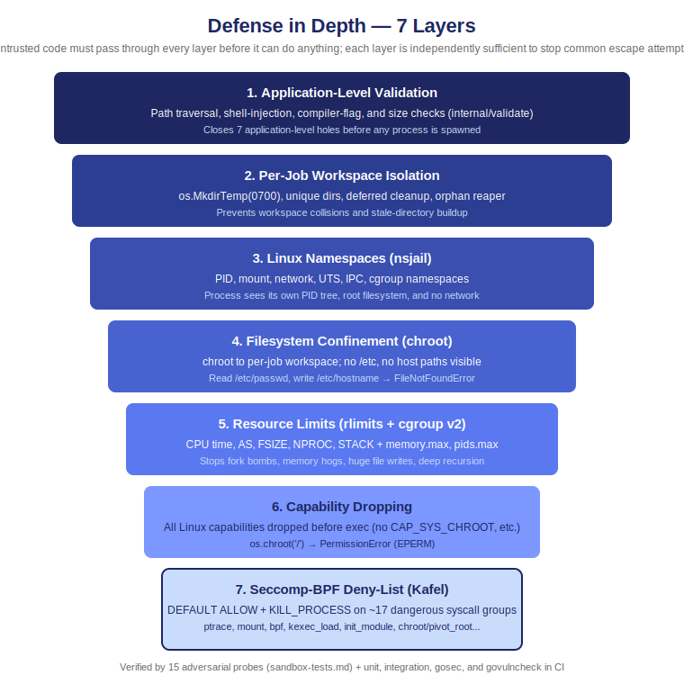

# Security

goboxd closes all seven vulnerabilities present in the Python reference implementation. Each section documents the risk, the fix, and the enforcing code location.

<div align="center">
  
</div>

---

<details>
<summary><strong>1. Path Traversal via Filename</strong></summary>

**Risk:** A client-supplied filename like `../../etc/passwd`, joined with `filepath.Join`, writes to host files outside the workspace.

**Fix:** Every filename from the request passes `validate.Filename()` before any path join. Enforces: `filepath.Base(n) == n`, only `[a-zA-Z0-9._-]+`, no leading dot, max 64 characters. This holds even for languages with a fixed server-side filename (e.g. `cpp`): `resolveFilename` validates a client-supplied name and rejects a malformed one with `400 invalid_filename` rather than silently ignoring it.

**Enforced in:** `internal/handler/run.go` (`resolveFilename`), before `filepath.Join(ws.Dir, filename)`.

</details>

<details>
<summary><strong>2. Shell Invocation</strong></summary>

**Risk:** String-formatting commands and running them through a shell allows metacharacter injection. A filename containing `; rm -rf /` executes arbitrary code when passed to `exec.Command("sh", "-c", ...)`.

**Fix:** No shell is invoked anywhere. `NewWorkspace` uses `os.MkdirTemp`, `Cleanup` uses `os.RemoveAll`, and every external program is launched as a pure `[]string` argv via `exec.CommandContext`.

**Enforced in:** `internal/sandbox/workspace.go`, `internal/sandbox/nsjail.go`.

</details>

<details>
<summary><strong>3. Compiler-Flag Injection</strong></summary>

**Risk:** Arbitrary flags appended to `gcc`/`g++`/`javac` give compile-time code execution. `-fplugin=evil.so` loads an attacker-controlled shared library. `-B/tmp` redirects the toolchain. `@file` reads additional flags from an attacker-controlled path.

**Fix:** `validate.Flags()` checks every flag against a per-language `flag_allowlist` from `configs/languages.yaml`. Prefix matching is supported (`-std=*`). Any unlisted flag returns `400 invalid_flag`.

**Enforced in:** `internal/handler/run.go`, before `runner.Submit`.

</details>

<details>
<summary><strong>4. Unbounded Request Sizes</strong></summary>

**Risk:** Uncapped source, stdin, or expected_stdout payloads exhaust server memory and disk.

**Fix (four layers):**

1. **`handler.BodyLimit`:** `http.MaxBytesReader` set to `source_max + tests x 2 x stdin_max + 64 KiB` before JSON decode.
2. **`validate.SourceSize`:** rejects source over `MAX_SOURCE_BYTES` (default 256 KiB).
3. **`validate.StdinSize` / `validate.ExpectedSize`:** rejects oversized per-test fields.
4. **`io.LimitReader(pipe, max+1)`** in `sandbox.Run`: caps captured stdout per phase.

**Enforced in:** `internal/handler/middleware.go`, `internal/handler/run.go`, `internal/sandbox/nsjail.go`.

</details>

<details>
<summary><strong>5. Workspace Collisions Under Load</strong></summary>

**Risk:** A random UID scheme (e.g. `rand.Intn(30000)`) collides under concurrent load, causing two jobs to share a workspace and read each other's source files.

**Fix:** `os.MkdirTemp(jailDir, "goboxd-*")` atomically creates a unique directory. No counter, no retry loop.

**Enforced in:** `internal/sandbox/workspace.go:NewWorkspace`.

</details>

<details>
<summary><strong>6. Unbounded Child Output</strong></summary>

**Risk:** A process writing gigabytes of data, read with `io.ReadAll`, causes host OOM.

**Fix:** `io.LimitReader(stdoutPipe, maxBytes+1)` in `sandbox.Run`. When the limit is hit, output is truncated and a `\n[output truncated]` marker is appended. The remaining pipe drains to `io.Discard` so the sandboxed process is not blocked on write.

**Enforced in:** `internal/sandbox/nsjail.go:Run`.

</details>

<details>
<summary><strong>7. Stale Jail Directories</strong></summary>

**Risk:** A panic between workspace creation and cleanup leaks the directory permanently, filling the disk over time.

**Fix (two mechanisms):**

1. **`defer ws.Cleanup()`** is placed immediately after `NewWorkspace`, running on every exit path including panics caught by the `Recoverer` middleware.
2. **`SweepOrphans`** at startup and on a periodic ticker removes any `goboxd-*` directories older than `ORPHAN_MAX_AGE_MINUTES` (default 30 minutes) left from previous unclean shutdowns. Age-gating ensures it never touches an in-flight job's workspace.

**Enforced in:** `internal/runner/runner.go`, `internal/sandbox/workspace.go:SweepOrphans`, `cmd/goboxd/main.go`.

</details>

---

## Seccomp-BPF Syscall Filtering

Beyond the seven architectural fixes, goboxd passes a Kafel deny-list to nsjail via `--seccomp_string`. `DEFAULT ALLOW` keeps all 15 language runtimes working without enumerating their required syscalls. `KILL_PROCESS` (not `KILL`) terminates the whole process group, not just the offending thread.

The exact policy is defined in `internal/sandbox/nsjail.go:seccompPolicy`.

| Syscall(s) | Risk blocked |
|------------|-------------|
| `ptrace`, `process_vm_readv`, `process_vm_writev` | Cross-process memory inspection; sandbox escape primitive |
| `init_module`, `finit_module`, `delete_module` | Kernel module loading; arbitrary kernel code execution |
| `kexec_load` | Replace the running kernel |
| `reboot` | Unauthorized system restart |
| `settimeofday`, `adjtimex`, `clock_adjtime` | Host clock skew; affects timeout logic and log timestamps |
| `mknodat` | Create device nodes; enables device escapes inside a chroot |
| `chroot`, `pivot_root` | Change filesystem root; escapes nsjail bind-mount restrictions |
| `unshare`, `setns` | Manipulate Linux namespaces; un-isolates network, PID, or mount namespace |
| `userfaultfd` | Pause kernel page-fault handling from userspace; used in many exploit chains |
| `name_to_handle_at`, `open_by_handle_at` | Cross mount-point boundaries via file handles |
| `acct` | Process accounting; can interfere with host resource bookkeeping |
| `bpf` | Load eBPF programs; kernel-level arbitrary code execution |
| `syslog` | Read the kernel ring buffer; information leak |
| `add_key`, `request_key`, `keyctl` | Kernel keyring; persists data across sandbox invocations via session keyring |
| `fanotify_init` | Filesystem access notification; leaks path information |
| `capset` | Modify process capabilities; defence against privilege re-escalation |
| `mount` | Mount filesystems; seccomp denial prevents user-namespace tricks even without `CAP_SYS_ADMIN` |

<details>
<summary>Intentionally not denied</summary>

- `perf_event_open`: the JVM requires it for profiling (Kotlin, Java).
- `socket`, `connect`, `bind`: network access is blocked at the nsjail network namespace level; seccomp denial is redundant.
- `mknod`, `io_uring_*`, `kexec_file_load`: absent from the ARM64 Kafel syscall table; a deny rule for a non-existent syscall fails policy compilation.

</details>

---

## Containment Test Suite

A standalone probe runner at `tests/sandbox/` submits 15 adversarial programs to a live goboxd service and verifies the sandbox contained each one. Separate from the integration suite; produces a Markdown report.

```bash
make run                                          # terminal 1
go run ./tests/sandbox/                           # terminal 2
go run ./tests/sandbox/ --out docs/sandbox-report.md  # save report
```

Full documentation and per-probe explanations: [sandbox-tests.md](sandbox-tests.md)

---

## How These Fixes Are Verified

| Layer | What it proves | Where |
|-------|----------------|-------|
| Unit tests | Filename, flag, size, and limit validators reject the exact attack inputs | `internal/validate/request_test.go`, `internal/handler/run_test.go` |
| Integration tests | Path traversal gives `400 invalid_filename`; disallowed flag gives `400 invalid_flag`; oversize source and limit overrides also rejected | `tests/integration/run_test.go` |
| Adversarial suite | The sandbox actually contains fork bombs, chroot/ptrace escapes, network attempts, and OOM/output bombs at runtime | `tests/sandbox/` |
| `gosec` (lint) | Flags insecure Go patterns; the only suppressions are the documented `[]string`-argv exclusion (G204) and per-line cgroup/proc path notes | `.golangci.yml`, CI |
| `govulncheck` (CI) | No known, reachable CVE in any dependency or the Go stdlib | `.github/workflows/ci.yml` |

The whole pipeline runs on every push and PR (see [ci-cd.md](ci-cd.md)). A path that came from the request body and reaches the filesystem or an `exec` argv without passing the matching validator is, by construction, a build-or-test failure.

---

<!-- nav-footer -->
<sub>[← Documentation index](README.md) · [API](api.md) · [Architecture](architecture.md) · [Concurrency](concurrency.md) · [Security](security.md) · [Languages](languages.md) · [Configuration](configuration.md)</sub>
